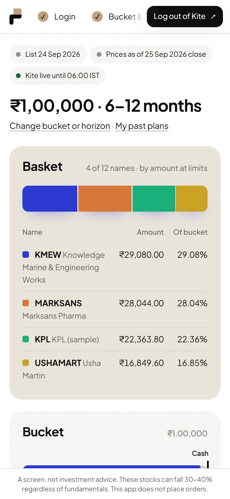
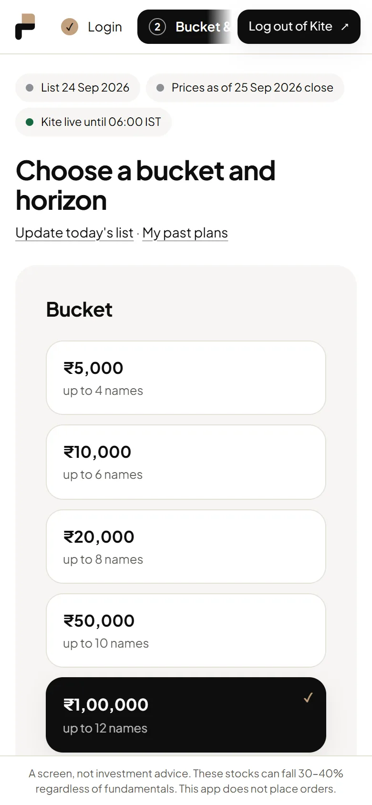
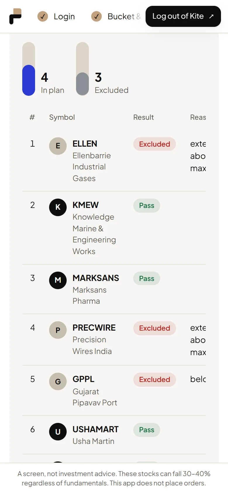
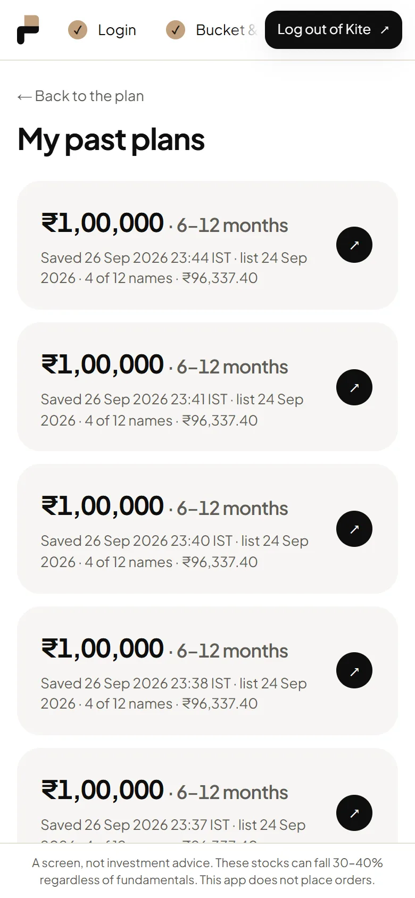

# Zerodha Basket Planner

**[Live app](https://zerodha-basket-planner.vercel.app)** · [How this site works](https://zerodha-basket-planner.vercel.app/how-it-works)

You have a daily ranked list of stocks and a fixed amount to invest. How many
shares of each do you buy, and at what limit price, so the money is spread by
conviction and never overspent?

This app answers that question. Log in with Kite, pick a bucket (₹5,000 to
₹2,00,000) and a horizon (3–6 to 18–24 months), and it sizes a basket from the
ranked list using NSE end-of-day prices. For every position it shows the
quantity, the buy limit, the amount and the weight against its target. It also
shows every candidate it left out, and why.



> **Read-only by design.** The app never places orders, GTTs or baskets. The
> Kite client can only call an allow-list of endpoints, and a test fails the
> build if order code appears. The app does not pick stocks and does not give
> advice: a plan is a screen's output sized to a bucket.

## How a plan is built

1. **Checks.** Each candidate on the ranked list is tested against NSE
   bhavcopy history: trend (moving averages), how extended it is, liquidity,
   series `EQ`, and at least 50 sessions of data. A failed candidate is never
   dropped silently. It is shown with its numbers and a reason.
2. **Target weights.** Passing names are weighted by the midpoint of their
   upside range, up to the bucket's depth (4 to 14 names).
3. **Feasibility.** A name is admitted only if one share at its limit costs no
   more than 1.5 × its target amount. Names that fail are listed as deferred.
4. **Sizing.** Limit = close × 1.015, rounded down to the NSE tick. All money
   math is in integer paise, and `Σ qty × limit ≤ bucket` is asserted before a
   plan is shown.
5. **Holdings overlap.** Existing Kite holdings in any candidate are shown
   alongside the plan.

Plans can be saved as immutable snapshots and revisited in History.

| Setup | Checks | History |
| --- | --- | --- |
|  |  |  |

## Stack

- **Next.js 16, React 19, TypeScript**, with Zod for the data contracts
- **Kite Connect Personal API** (free tier) for login, holdings and margins,
  through a small hand-written REST client and no SDK
- **NSE UDiFF bhavcopy**, fetched by a scheduled GitHub Action each trading
  evening and committed as `data/prices.json`
- **Upstash Redis** for the server-side session, with the access token
  encrypted at rest
- **Vitest + fast-check** for unit and property tests of the allocator
- Hand-written CSS design system with light and dark themes, and no UI or
  chart library

Design decisions are recorded in [`docs/adr/`](docs/adr) and the domain
vocabulary in [`CONTEXT.md`](CONTEXT.md).

## Run it locally

```bash
npm install
KITE_MOCK=1 npm run dev   # mock Kite client, no credentials needed
npm test
```

To use real Kite, set `KITE_API_KEY`, `KITE_API_SECRET`, `KITE_USER_ID`,
`TOKEN_ENC_KEY` and the Upstash Redis variables. A Kite Connect app is bound
to its creator's client ID, so the app is single-user: to use it yourself,
fork it and deploy with your own Kite app ([ADR 0001](docs/adr/0001-single-user-kite-login-gate.md)).

## Disclaimer

This is a personal tool, not investment advice. It places no orders. Prices are
end-of-day closes and can be one session old.
